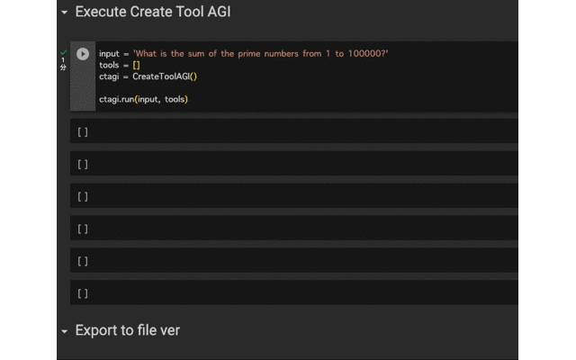

# CreateTool-AGI


- [What is CreateTool-AGI?](#what-is-createtool-agi)
- [How It Works](#how-it-works)
- [How to Use](#how-to-use)
- [Supported Models](#supported-models)
- [Contributor](#contributor)
- [Backstory](#backstory)


## What is CreateTool-AGI?
　This Python script is designed to enhance the capabilities of the Large Language Model (LLM) by utilizing LangChain's Tools feature: CreateTool-AGI automatically generates Tools for each input question and uses them to answer the question. This feature allows users to solve problems that are difficult to solve with LLM alone, but can be written in a program.
　Another important feature of this system is that it can output the Python scripts used to derive the answers, so that the correctness of the logic can be verified.
　In addition, once created, the Python script is immediately available as a Tool and can be used to solve problems with similar inputs.

　CreateTool-AGI creates new Tools each time a new question is entered, allowing it to improve its capabilities autonomously.



## How It Works
This script is executed in the following order:

1. Generalization of input problems
2. Determine if the solution can be solved with the available Tools.
3. Creation of Tools.
4. Output answers to questions using the created Tools.


## How to Use
To use the script, you will need to follow these steps:

1. Get [OpenAI's API key](https://platform.openai.com/account/api-keys)

2. Pip install with the following command
```
pip install git+https://github.com/fuyu-quant/CreateTool-AGI.git
```
3. Install required libraries
```
pip install langchain==0.0.167
pip install openai==0.27.4
```
4. You can execute the program as follows．Check [this notebook](https://github.com/fuyu-quant/CreateTool-AGI/blob/main/examples/createtoolagi.ipynb) for detailed examples.
```
from createtoolagi import CreateToolAGI

input = 'What is the sum of the prime numbers from 1 to 10000?'
tools = []
ctagi = CreateToolAGI()

ctagi.run(input, tools)
```
output
```
> Generalize the input task.
Generalized Task：What is the sum of the prime numbers from A to B?

> Determine if you should make a tool.
I must create the tool before executing.

try:1
> Create a tool.
Completed!
Created tool name：PrimeSumTool


> Entering new AgentExecutor chain...
I need to find the sum of prime numbers between 1 and 100000.
Action: PrimeSumTool
Action Input: 1,100000
Observation: 454396537
Thought:I now know the final answer.
Final Answer: 454396537

> Finished chain.
```

## Supported Models
Currently, the recommended model is GPT-4; GPT-3.5-turbo often does not run well


## Backstory
This idea is based on [langchain-tools](https://github.com/fuyu-quant/langchain-tools), which was created in an attempt to make LLM learn LightGBM.


